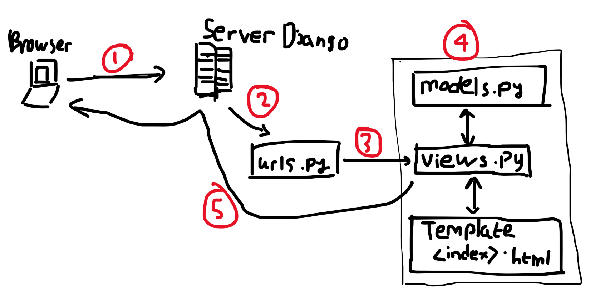

# tugas2pbp

Link to webpage: 
-> [on domcloud.io](https://my-hsr-inventory.domcloud.io/) 

Link to main: [here](./main) 
Last checklist items: 
[Implementasi](#how-to)
\- [request client](#heres-a-picture-maybe)
\- [venv](#why-use)
\- [MVC, MVT, MVVM](#what-is)
  

## Checklist:
- [x] Membuat sebuah proyek Django baru.
- [x] Membuat aplikasi dengan nama `main` pada proyek tersebut.
- [x] Melakukan *routing* pada proyek agar dapat menjalankan aplikasi `main`. 
- [x] Membuat model pada aplikasi `main` dengan nama `Item` dan memiliki atribut wajib sebagai berikut. 
    - `name` sebagai nama *item* dengan tipe `CharField`.
    - `amount` sebagai jumlah *item* dengan tipe `IntegerField`.
    - `description` sebagai deskripsi *item* dengan tipe `TextField`.
- [x] Membuat sebuah fungsi pada `views.py` untuk dikembalikan ke dalam sebuah *template* HTML yang menampilkan nama aplikasi serta nama dan kelas kamu.
- [x] Membuat sebuah *routing* pada `urls.py` aplikasi `main` untuk memetakan fungsi yang telah dibuat pada `views.py`.
- [x] Melakukan *deployment* ke Adaptable terhadap aplikasi yang sudah dibuat sehingga nantinya dapat diakses oleh teman-temanmu melalui Internet. 
- [ ] Membuat sebuah `README.md` yang berisi tautan menuju aplikasi Adaptable yang sudah di-*deploy*, serta jawaban dari beberapa pertanyaan berikut.
    - Jelaskan bagaimana cara kamu mengimplementasikan *checklist* di atas secara *step-by-step* (bukan hanya sekadar mengikuti tutorial).
    - Buatlah bagan yang berisi *request client* ke web aplikasi berbasis Django beserta responnya dan jelaskan pada bagan tersebut kaitan antara `urls.py`, `views.py`, `models.py`, dan berkas `html`.
    - Jelaskan mengapa kita menggunakan ***virtual environment***? Apakah kita tetap dapat membuat aplikasi web berbasis Django tanpa menggunakan ***virtual environment***?
    - Jelaskan apakah itu MVC, MVT, MVVM dan perbedaan dari ketiganya.

---

## How to [↑](#)
#### Membuat sebuah proyek Django baru:
Buat git repository baru, lalu initialize ke sebuah folder lokal. 
Buat virtual environment python, aktifkan virtual environment dan install beberapa package yang diperlukan. 
Jalankan command `django-admin startproject inventory` (tetap didalam venv). 
Setup file inventory.settings agar semua host diperbolehkan akses website dan app `main`` terdaftar sebagai aplikasi website.

#### Membuat aplikasi dengan nama `main` pada proyek tersebut:
Jalankan command `django-admin startapp main`.

#### Melakukan *routing* pada proyek agar dapat menjalankan aplikasi `main`:
Menambahkan `path('main/', include('main.urls'))` di list urlpatterns di inventory.urls untuk mendefinisikan subdirektori main dengan file 'urls'nya sendiri.

#### Membuat model pada aplikasi `main` dengan nama `Item`:
Membuat class baru yang memiliki parent (`django.db.`)`models.Model`.
Menambahkan atribut menggunakan bawaan models. (contoh bil. bulat menggunakan `models.IntegerField()`, string menggunakan `models.TextField()`, dst.) 
Atribut yang dipakai adalah `name`, `amount`, `description`, `rarity`, `effect`, `image_dir`. (explained in `main.models`)

#### Membuat sebuah fungsi pada `views.py` untuk dikembalikan ke dalam sebuah *template* HTML:
Buat fungsi `show_main` yang mengambil template main.html dan dibundle dengan context yang diberikan untuk mengembalikan response yang merupakan sebuah website.

#### Membuat sebuah *routing* pada `urls.py` aplikasi `main` untuk memetakan fungsi yang telah dibuat pada `views.py`:
Di main.urls, buat list urlpatterns yang memuat 1 item, yang menghubungkan direktori `main/` dengan fungsi di main.views

#### Melakukan *deployment* ke Adaptable terhadap aplikasi yang sudah dibuat sehingga nantinya dapat diakses oleh teman-temanmu melalui Internet:
Hubungkan git repository ke adaptable.
Setup versi python dan command awal.
Wait deployment (😴😴😴) 
Done

#### Membuat sebuah `README.md` yang berisi tautan menuju aplikasi Adaptable yang sudah di-*deploy*:
You're reading this right now 👍👍👍👍 (keep going)

#### Bonus things *:)*
- Database implemented.
There's 21 items in the database and the server randomly chooses 5 items to show the user. (see `main.views.show_main`)  
- ~~Redirect from '/' to '/main/'~~ `'/'` is now a landing page containing this very file.
- Images! ([list here](./media/))
- 4 'new' tests:
    - `test_landing_using_markdown` => test this page
    - `test_static` => test the static files
    - `test_media` => test the media delivery
    - `test_main_items` => test main models

---

## here's a picture maybe [↑](#)

Cara request client diproses menjadi HTTP response: 
1. Browser mengirim sebuah HTTP request kepada server. 
2. Server mengirim request tersebut ke urls.py untuk dicek apakah ada path yang cocok dengan request tersebut. 
3. Jika terdapat path yang cocok, maka akan menjalankan fungsi di views.py berdasarkan path request tersebut. 
4. views.py kemudian mulai pemrosesan request dengan mengambil file .html dari template dan menggabungkannya dengan data dari models.py hingga menjadi sebuah .html yang siap disajikan. 
5. file .html dalam sebuah HTTP response *dipassing* ke server, lalu dikirim ke browser untuk ditampilkan. 

---

## Why use [↑](#)
Virtual environment digunakan karena dapat mengisolasi package serta dependencies antar aplikasi Django sehingga tidak bertabrakan dengan versi lain yang ada di komputer. Virtual environment juga memudahkan orang lain untuk membantu dalam proses development, karena orang tersebut dapat menginstall virtual environment yang sama persis dengan yang ada di komputer kita.

Pembuatan aplikasi web tanpa menggunakan *virtual environment* masih tetap bisa, tetapi ini tidak merupakan *best practices* karena dapat menimbulkan beberapa isu, salah satunya adalah konflik *dependencies*. Penginstallan *package* secara global akan menimbulkan konflik dependencies antar project yang masing-masing membutuhkan versi suatu *package* yang berbeda. Contoh misalkan project `shopping_list` membutuhkan versi `django==1.7` sedangkan project `inventory` membutuhkan versi `django==4.2.5`. 

---

## What is [↑](#)
MVC, MVT, dan MVVM merupakan sebuah pola desain/pola arsitektur yang digunakan ketika ingin mengembangkan sebuah aplikasi web.

### MVC (Model-View-Controller)
Pada pola arsitektur ini, aplikasi dibagi menjadi 3 bagian, yaitu (seperti namanya) models, views, dan *controller*. Bagian models berfungsi untuk menyimpan data dari aplikasi tersebut dan mengatur komunikasi antara database aplikasi dengan bagian aplikasi lain. Bagian views berfungsi untuk menampilkan website dengan mengambil data dari models dan membuat sebuah file html. Terakhir, bagian *controller* berfungsi sebagai interface bagi pengguna untuk berinteraksi dengan models (database) dan views (webpage) dari aplikasi tersebut.

### MVT (Model-View-Template)
Pola arsitektur ini hampir mirip dengan MVC, tetapi controller digantikan oleh framework yang digunakan. Pada pola ini, views menghandle semua *processing* yang harus dilakukan untuk menampilkan sebuah website, dengan dibantu oleh sebuah Template, yang berisi sebuah file html yang merupakan sebuah template yang dapat substitusi dengan data dari models atau data hard-coded. Pola arsitektur ini digunakan oleh framework Django.

### MVVM (Model-View-ViewModel)
Pola arsitektur ini (seperti yang lainnya) dibagi menjadi 3 bagian, yaitu models, views, dan ViewModel. Models dan views memiliki peran yang sama dengan pola-pola lainnya. ViewModel berperan sebagai perantara antara models dan views, dengan melakukan *data binding* dengan views tersebut, yang berarti data yang berada di views secara otomatis diupdate dengan data yang berada di ViewModel.

### Perbedaan
Di antara ketiga pola arsitektur tersebut, perbedaan yang paling besar adalah struktur masing-masing pola. Lebih spesifiknya, pola-pola tersebut berbeda di mana kontrol aplikasi berada. MVC menempatkan kontrol sebagai bagian luar mengirim perintah ke bagian lain, MVT memiliki kontrol yang menyeluruh, dan MVVM menempatkan kontrol sebagai *middleman* diantara views dan models.

---
## Thanks for reading
here's a cute sticker of bailu: 

github-markdown.css by <a href="https://github.com/sindresorhus/github-markdown-css">sindresorhus</a> and used under the MIT License 