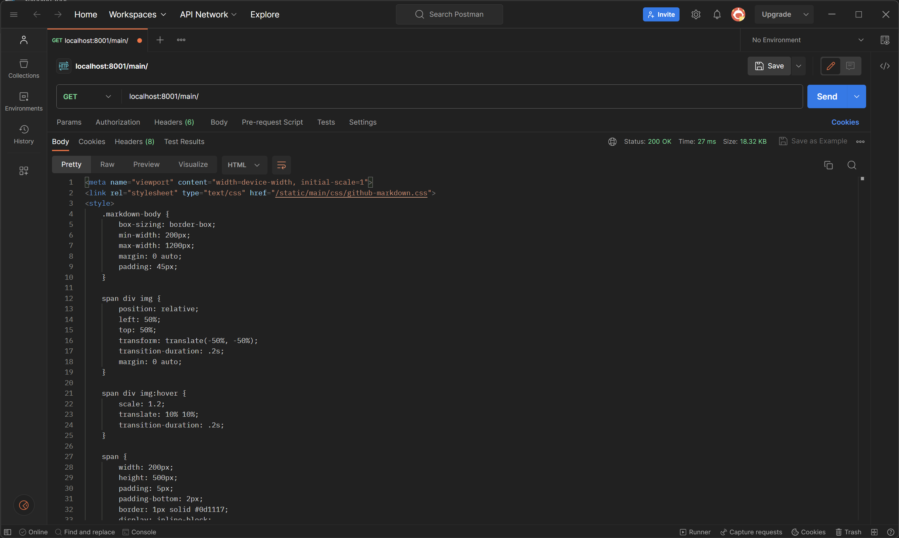
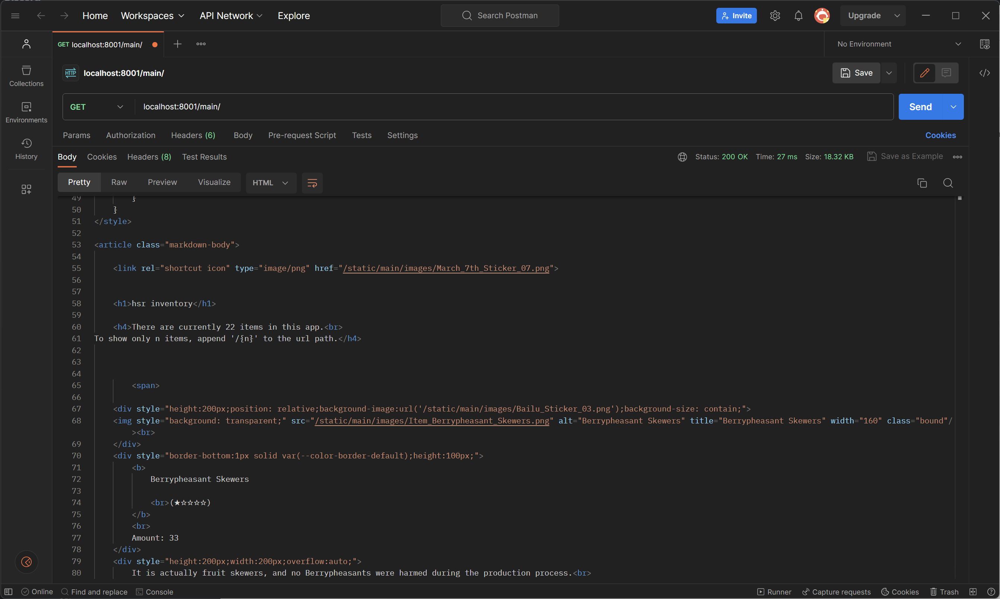
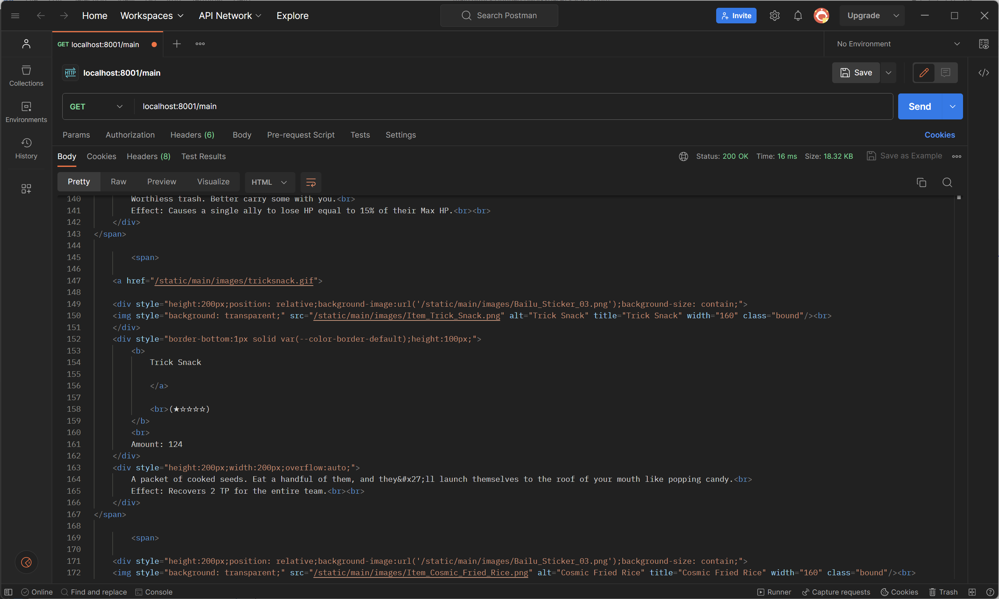
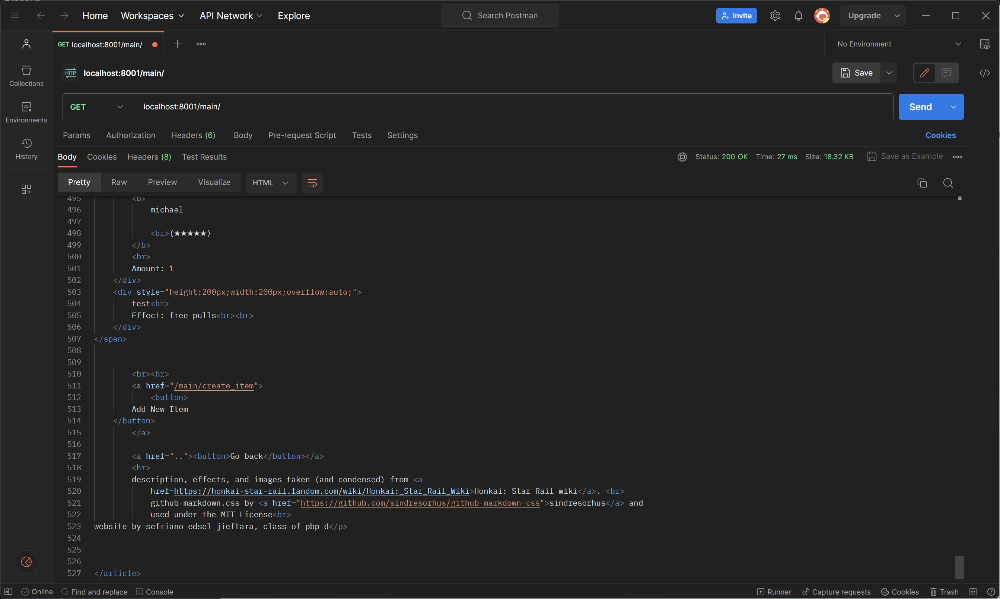
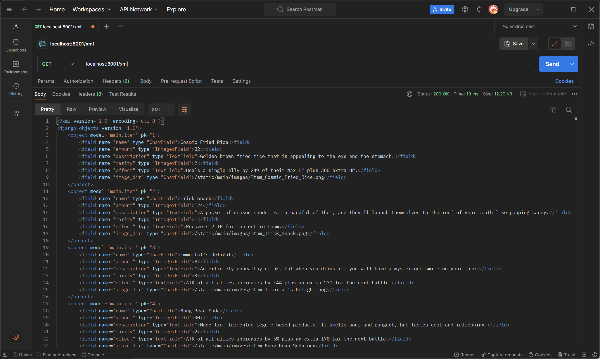
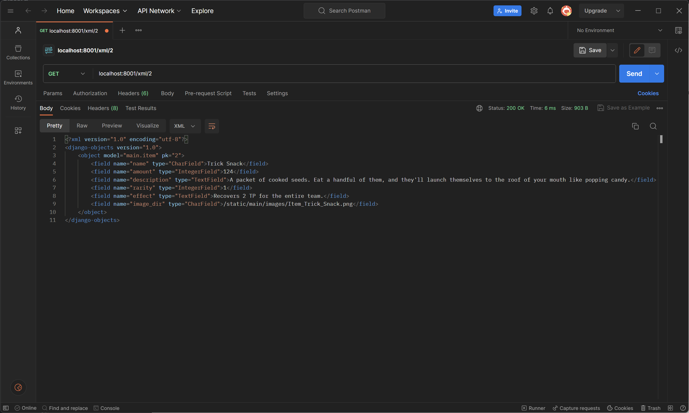
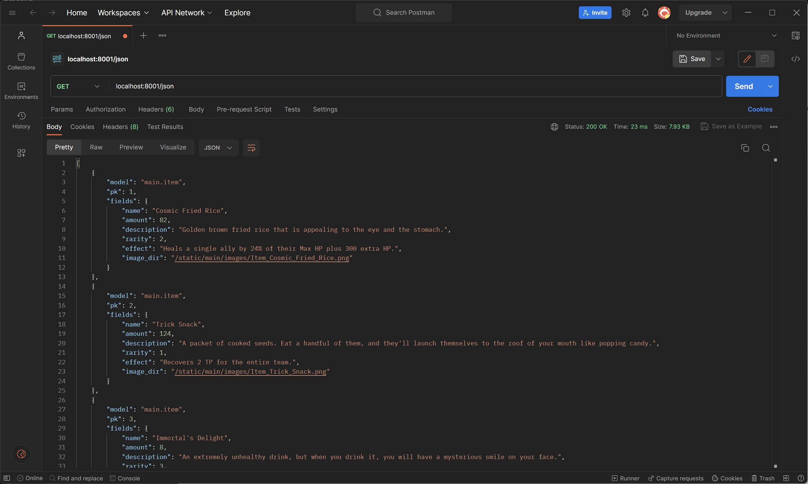
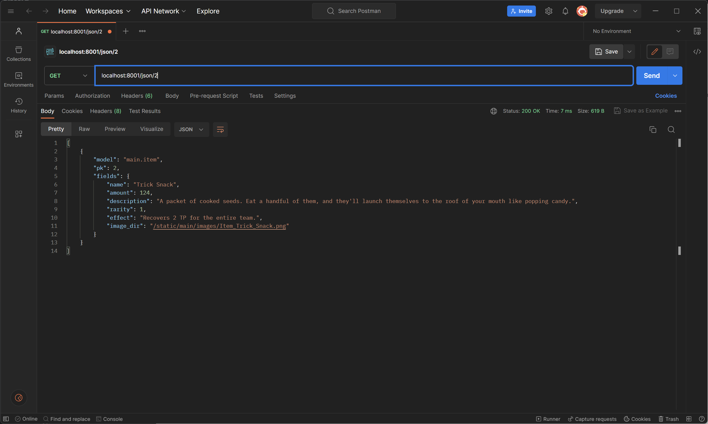

# tugas2pbp

Link to webpage: 
-> [on domcloud.io](https://my-hsr-inventory.domcloud.io/) 
Previous weeks page: [here](./archive/archive_list.md) 

(only works on the website) 
Link to main: [here](./main) 

Second last checklist items: 
[POST, GET](#pog-test)
\- [XML, JSON, HTML](#xmljs-on-html)
\- [JSON good](#json-the-best)
\- [Implementasi](#how-to) 
Last checklist item:
[Postman pictures](#images-of-the-elusive-postman)

 

## Checklist
- [x] Membuat input `form` untuk menambahkan objek model pada app sebelumnya.
- [x] Tambahkan 5 fungsi `views` untuk melihat objek yang sudah ditambahkan dalam format HTML, XML, JSON, XML *by ID*, dan JSON *by ID*.
- [x] Membuat routing URL untuk masing-masing `views` yang telah ditambahkan pada poin 2.
- [ ] Menjawab beberapa pertanyaan berikut pada `README.md` pada *root folder*.
    - [ ] Apa perbedaan antara form `POST` dan form `GET` dalam Django?
    - [ ] Apa perbedaan utama antara XML, JSON, dan HTML dalam konteks pengiriman data?
    - [ ] Mengapa JSON sering digunakan dalam pertukaran data antara aplikasi web modern?
    - [ ] Jelaskan bagaimana cara kamu mengimplementasikan *checklist* di atas secara *step-by-step* (bukan hanya sekadar mengikuti tutorial).
- [x] Mengakses kelima URL di poin 2 menggunakan Postman, membuat *screenshot* dari hasil akses URL pada Postman, dan menambahkannya ke dalam `README.md`.
- [x] Melakukan `add`-`commit`-`push` ke GitHub.

**Bonus:**
- [x] Menambahkan pesan "Kamu menyimpan X item pada aplikasi ini" (dengan X adalah jumlah data item yang tersimpan pada aplikasi) dan menampilkannya di atas tabel data. Kalimat pesan boleh dikustomisasi sesuai dengan tema aplikasi, namun harus memiliki makna yang sama.

---

## pog test [↑](#)
soontm

---

## xmljs on html [↑](#)
sometime later

---

## json the best [↑](#)
might be happening shortly

---

## How to [↑](#)
how???

---

## Images of the elusive "Postman" [↑](#)
#### HTML
Different regions of the same response.

 
Top of the file, contains style and meta things

 
Bonus item count display

 
A "random" item from the list

 
Bottom of the file, contains a button to add an item and a button to go back to root directory

##
#### XML + by id
 
XML response

 
XML response of the item with id==2

##
#### JSON + by id
 
JSON response

 
XML response of the item with id==2

---
github-markdown.css by <a href="https://github.com/sindresorhus/github-markdown-css">sindresorhus</a> and used under the MIT License 
website by sefriano edsel jieftara, class of pbp d