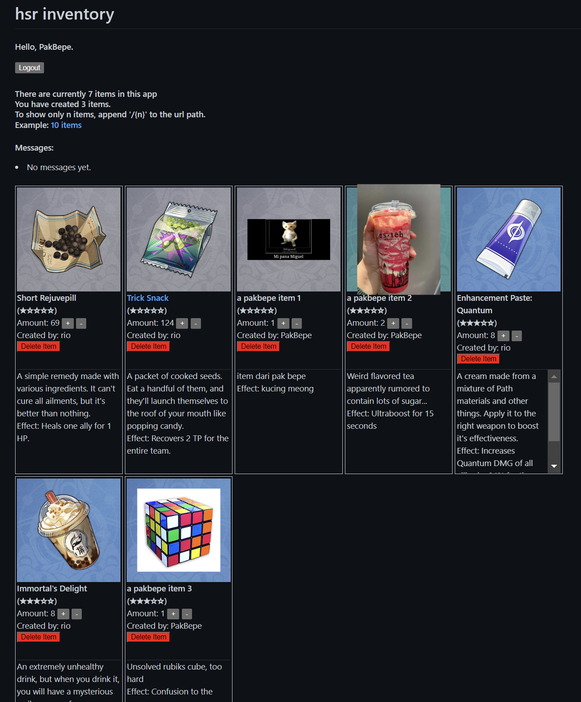

# tugas4pbp

Link to webpage: 
-> Not online yet, just clone the repository and run it locally.
Previous weeks page: [here](./archive/archive_list.md) 

(only works on the website) 
Link to main: [here](./main) 

Second last checklist items: 
[UserCreationForm](#genesis)
\- [Authentic & Authoric](#wolves)
\- [Eat cookies](#yummy)
\- [Bad cookies](#yucky)
\- [Implementasi](#How-to) 

 

## Checklist
- [x] Mengimplementasikan fungsi registrasi, login, dan logout untuk memungkinkan pengguna untuk mengakses aplikasi sebelumnya dengan lancar.
- [x] Membuat **dua** akun pengguna dengan masing-masing **tiga** *dummy data* menggunakan model yang telah dibuat pada aplikasi sebelumnya untuk setiap akun **di lokal**.
- [x] Menghubungkan model `Item` dengan `User`.
- [x] Menampilkan detail informasi pengguna yang sedang *logged in* seperti *username* dan menerapkan `cookies` seperti `last login` pada halaman utama aplikasi.
- [ ] Menjawab beberapa pertanyaan berikut pada `README.md` pada *root folder* (silakan modifikasi `README.md` yang telah kamu buat sebelumnya; tambahkan subjudul untuk setiap tugas).
    - [ ] Apa itu Django `UserCreationForm`, dan jelaskan apa kelebihan dan kekurangannya?
    - [ ] Apa perbedaan antara autentikasi dan otorisasi dalam konteks Django, dan mengapa keduanya penting?
    - [ ] Apa itu *cookies* dalam konteks aplikasi web, dan bagaimana Django menggunakan *cookies* untuk mengelola data sesi pengguna?
    - [ ] Apakah penggunaan *cookies* aman secara *default* dalam pengembangan web, atau apakah ada risiko potensial yang harus diwaspadai?
    - [ ] Jelaskan bagaimana cara kamu mengimplementasikan *checklist* di atas secara *step-by-step* (bukan hanya sekadar mengikuti tutorial).
- [x] Melakukan `add`-`commit`-`push` ke GitHub.

**Bonus:**
- [x] Tambahkan tombol dan fungsi untuk menambahkan `amount` suatu objek sebanyak satu dan tombol untuk mengurangi jumlah stok suatu objek sebanyak satu.
- [x] Tambahkan tombol dan fungsi untuk menghapus suatu objek dari inventori.
Kedua fitur di atas wajib diimplementaskan (bukan sekedar tombol, melainkan harus dapat melakukan fungsi yang diinginkan) jika kamu ingin mendapatkan nilai bonus.

---

## genesis [↑](#)

---

## wolves [↑](#)

---

## yummy cookies [↑](#)

---

## yucky cookies [↑](#)

---

## How to [↑](#)

#### Mengimplementasikan fungsi registrasi, login, dan logout untuk memungkinkan pengguna untuk mengakses aplikasi sebelumnya dengan lancar.

#### Membuat **dua** akun pengguna dengan masing-masing **tiga** *dummy data* menggunakan model yang telah dibuat pada aplikasi sebelumnya untuk setiap akun **di lokal**.
 
Pada website, terdapat sebuah user "rio" yang merupakan admin, dan user "PakBepe" yang merupakan user biasa.

#### Menghubungkan model `Item` dengan `User`.

#### Menampilkan detail informasi pengguna yang sedang *logged in* seperti *username* dan menerapkan `cookies` seperti `last login` pada halaman utama aplikasi.

#### Tambahkan tombol dan fungsi untuk menambahkan `amount` suatu objek sebanyak satu dan tombol untuk mengurangi jumlah stok suatu objek sebanyak satu.

#### Tambahkan tombol dan fungsi untuk menghapus suatu objek dari inventori.

---
github-markdown.css by <a href="https://github.com/sindresorhus/github-markdown-css">sindresorhus</a> and used under the MIT License 
website by sefriano edsel jieftara, class of pbp d